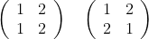
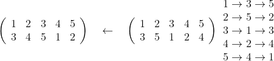
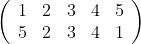
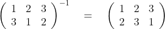
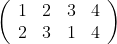

# Permutation Operations in Rust

#### Permutation Examples

A permutation is the order left to right that a set of objects can be arranged. Thus the set {1,2} has the permutations:   {1,2},  {2,1}. The number of permutations for a given set of objects is **n!** where n is the number of objects (order) and ! is n factorial.

A permutation can be written as a two rows of numbers. The permutations of the order 2 set \{1,2\} can be written as:



We can express this in rust as:

######     perm1.rs

```rust
fn main() {
    let v = vec![1, 2];
    let v2 = vec![2, 1];

    println!("{:?}", v);
    println!("{:?}", v);
    println!();

    println!("{:?}", v);
    println!("{:?}", v2);
}

```

Which produces the output:

```bash
$ cargo run --bin perm1
    Finished dev [unoptimized + debuginfo] target(s) in 0.00s
     Running `target/debug/perm1`
[1, 2]
[1, 2]

[1, 2]
[2, 1]
```

While this works, it would be nice to aggerate permutation information in a Rust struct. The following source code creates a **Permutation** struct and implements the **Display** trait for it.

 ######     perm2.rs

```rust
use std::fmt;

#[derive(Clone, PartialEq)]
pub struct Permutation {
    pub order: i32,
    pub top_row: Vec<i32>,
    pub bottom_row: Vec<i32>,
}

impl fmt::Display for Permutation {
    fn fmt(&self, f: &mut fmt::Formatter<'_>) -> fmt::Result {
        write!(f, "{:?}\n{:?}\n", self.top_row, self.bottom_row)
    }
}

fn main() {
    let v = vec![1, 2];
    let v2 = vec![2, 1];

    let p1 = Permutation {
        order: 2,
        top_row: v.clone(),
        bottom_row: v.clone(),
    };

    let p2 = Permutation {
        order: 2,
        top_row: v.clone(),
        bottom_row: v2.clone(),
    };

    println!("{}", p1);

    println!("{}", p2);
}


```

Run the following to produce the output:

```bash
s$ cargo run --bin perm2
    Finished dev [unoptimized + debuginfo] target(s) in 0.00s
     Running `target/debug/perm2`
[1, 2]
[1, 2]

[1, 2]
[2, 1]
```

While I love filling out struct declarations manually you probably don't so let's create a **new** method that takes two vectors:

######     perm3.rs

```rust
use std::fmt;

#[derive(Clone, PartialEq)]
pub struct Permutation {
    pub order: i32,
    pub top_row: Vec<i32>,
    pub bottom_row: Vec<i32>,
}

impl fmt::Display for Permutation {
    fn fmt(&self, f: &mut fmt::Formatter<'_>) -> fmt::Result {
        write!(f, "{:?}\n{:?}\n", self.top_row, self.bottom_row)
    }
}

impl Permutation {

    // start of new method ***************
    pub fn new(tr: Vec<i32>, br: Vec<i32>) -> Permutation {
        Permutation {
            order: tr.len() as i32,
            top_row: tr.clone(),
            bottom_row: br.clone()
        }
    }
    // end of new method ***************


}

fn main() {
    let v = vec![1, 2];
    let v2 = vec![2, 1];

    let p1 = Permutation::new(v.clone(), v.clone());

    let p2 = Permutation::new(v.clone(), v2.clone());


    println!("{}", p1);

    println!("{}", p2);
}


```

#### Permutation Product

The permutation product is the composition of two permutations. The product is calculated from right to left. An example order 5 permutation product would be:



1. In the right array 1 maps to 3, then 3 maps to 5 in the left array. Thus the first value in the bottom row of the resultant permutation is 5.
2. In the right array 2 maps to 5, then 5 maps to 2 in the left array. Thus the second value in the bottom row of the resultant permutation is 2.
3. In the right array 3 maps to 1, then 1 maps to 3 in the left array. Thus the third value in the bottom row of the resultant permutation is 3.
4. In the right array 4 maps to 2, then 2 maps to 4 in the left array. Thus the fourth value in the bottom row of the resultant permutation is 4.
5. In the right array 5 maps to 4, then 4 maps to 1 in the left array. Thus the fifth value in the bottom row of the resultant permutation is 1.

And the resultant permutation is:



We will create a **product** method and implement the **Mul** trait (*) the source looks as follows:

######     perm_prod.rs

```rust
use std::fmt;
use std::ops;

#[derive(Clone, PartialEq)]
pub struct Permutation {
    pub order: i32,
    pub top_row: Vec<i32>,
    pub bottom_row: Vec<i32>,
    pub full_rep: String,
}

impl fmt::Display for Permutation {
    fn fmt(&self, f: &mut fmt::Formatter<'_>) -> fmt::Result {
        if self.full_rep != String::from("") {
            write!(f, "{}", self.full_rep)

        }
        else {
        
            write!(f, "{}", self.to_string())

        }
    }
}

impl Permutation {
    pub fn new(tr: Vec<i32>, br: Vec<i32>) -> Permutation {
        Permutation {
            order: tr.len() as i32,
            top_row: tr.clone(),
            bottom_row: br.clone(),
            full_rep: String::from("")
        }
    }

    //Start of product method ********************
    pub fn product(a: Permutation, b: Permutation) -> Permutation {
        let mut perm = Vec::new();

        for i in 0..a.top_row.len() {
            let ib = b.bottom_row[i] - 1;
            let ia = a.bottom_row[ib as usize];
            perm.push(ia);
        }

        let mut p = Permutation::new(a.top_row.clone(), perm);
        p.full_rep = format!("{:?}{:?}   {:?}\n{:?}{:?} = {:?}", 
        a.top_row,
        b.top_row, 
        p.top_row,
        a.bottom_row,
        b.bottom_row, 
        p.bottom_row);

        p
    }
    //End of product method ********************

    pub fn to_string(&self) -> String{

        format!("{:?}\n{:?}\n", self.top_row, self.bottom_row)
    }    
}

//Start of Mul trait impl ********************

impl ops::Mul<Permutation> for Permutation {
    type Output = Self;

    fn mul(self, rhs: Self) -> Self {
        Self::product(self, rhs)
    }
}
//End of Mul trait impl ********************


fn main() {
    let v = vec![1, 2, 3, 4, 5];

    let v1 = vec![3, 4, 5, 1, 2];
    let v2 = vec![3, 5, 1, 2, 4];

    let  p1 = Permutation::new(v.clone(), v1);
    let  p2 = Permutation::new(v.clone(), v2);

    let p3 = p1.clone() * p2.clone();

    println!("{}", p3);
}


```

Notice we added a new **full_rep** field to the **Permutation** struct and added a **to_string** method. 


Running the above will produce the following output:

```bash
$ cargo run --bin perm_prod
    Finished dev [unoptimized + debuginfo] target(s) in 0.00s
     Running `target/debug/perm_prod`
[1, 2, 3, 4, 5][1, 2, 3, 4, 5]   [1, 2, 3, 4, 5]
[3, 4, 5, 1, 2][3, 5, 1, 2, 4] = [5, 2, 3, 4, 1]
```

#### Permutation Identity

The permutation identity is any permutation that has the same top row as bottom row. (The top row is ordered). So for an order 4 permutation the identity is:


#### Permutation Inverse

A permutation inverse is a permutation that when the product is taken with another permutation returns the identity permutation.  This is shown below for n = 3:



We will calculate the inverse permutation of order 4. 

1. Exchange top row with bottom row 
2. 1 goes to 2 in new permutation 
3. 2 goes to 3 in new permutation 
4. 3 goes to 1 in new permutation  
5. 4 goes to 4 in new permutation  
6. We are done.

We will create a **inverse** method. The source is below.

######     perm_inverse.rs

```rust
use std::fmt;
use std::ops;

#[derive(Clone, PartialEq)]
pub struct Permutation {
    pub order: i32,
    pub top_row: Vec<i32>,
    pub bottom_row: Vec<i32>,
    pub full_rep: String,
}

impl fmt::Display for Permutation {
    fn fmt(&self, f: &mut fmt::Formatter<'_>) -> fmt::Result {
        if self.full_rep != String::from("") {
            write!(f, "{}", self.full_rep)

        }
        else {
        
            write!(f, "{}", self.to_string())

        }
    }
}

impl Permutation {
    pub fn new(tr: Vec<i32>, br: Vec<i32>) -> Permutation {
        Permutation {
            order: tr.len() as i32,
            top_row: tr.clone(),
            bottom_row: br.clone(),
            full_rep: String::from("")
        }
    }

    pub fn product(a: Permutation, b: Permutation) -> Permutation {
        let mut perm = Vec::new();

        for i in 0..a.top_row.len() {
            let ib = b.bottom_row[i] - 1;
            let ia = a.bottom_row[ib as usize];
            perm.push(ia);
        }

        let mut p = Permutation::new(a.top_row.clone(), perm);
        p.full_rep = format!("{:?}{:?}   {:?}\n{:?}{:?} = {:?}", 
        a.top_row,
        b.top_row, 
        p.top_row,
        a.bottom_row,
        b.bottom_row, 
        p.bottom_row);

        p
    }

    //start of inverse method***************
    pub fn inverse(&mut self) -> Permutation {
        let mut perm = self.top_row.clone();

        for i in 0..self.bottom_row.len() {
            let ib = self.bottom_row[i] - 1;
            let ia = self.top_row[i];
            perm[ib as usize] = ia;
        }

        let  p = Permutation::new(self.top_row.clone(), perm);

        p
    }
    //end of inverse method***************

    pub fn to_string(&self) -> String{

        format!("{:?}\n{:?}\n", self.top_row, self.bottom_row)
    }    
}

impl ops::Mul<Permutation> for Permutation {
    type Output = Self;

    fn mul(self, rhs: Self) -> Self {
        Self::product(self, rhs)
    }
}


fn main() {
    let v = vec![1, 2, 3, 4];

    let v1 = vec![1, 3, 4, 2];

    let  mut p1 = Permutation::new(v.clone(), v1);

    let p2 = p1.inverse();


    println!("{}", p2);

    let p3 = p1 * p2.clone();

    println!("{}", p3);

}


```


Running the above produces the following output:

```bash
$ cargo run --bin perm_inverse
   Compiling permutation_operations v0.1.0 (/home/brad/RustProjects/permutation_operations)
    Finished dev [unoptimized + debuginfo] target(s) in 0.53s
     Running `target/debug/perm_inverse`
[1, 2, 3, 4]
[1, 4, 2, 3]

[1, 2, 3, 4][1, 2, 3, 4]   [1, 2, 3, 4]
[1, 3, 4, 2][1, 4, 2, 3] = [1, 2, 3, 4]
```

Notice how taking the product of the two permutations produces the identity permutation.


